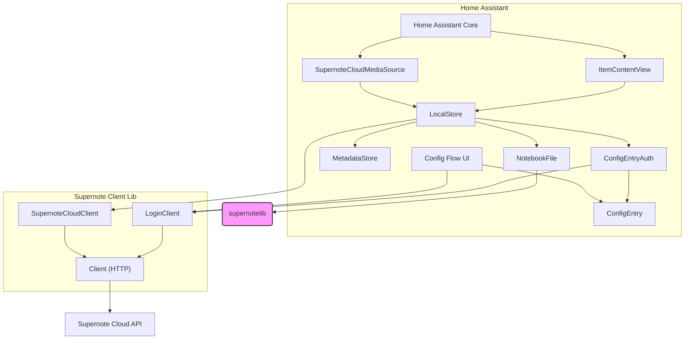
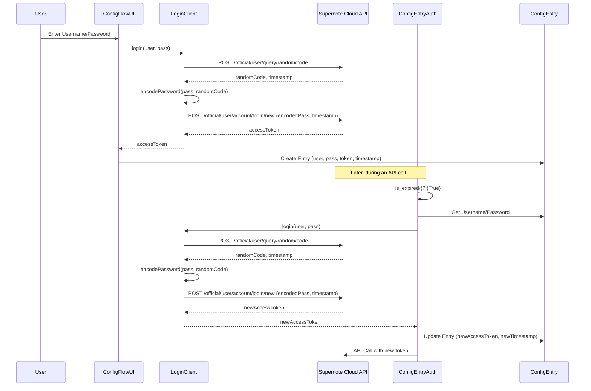
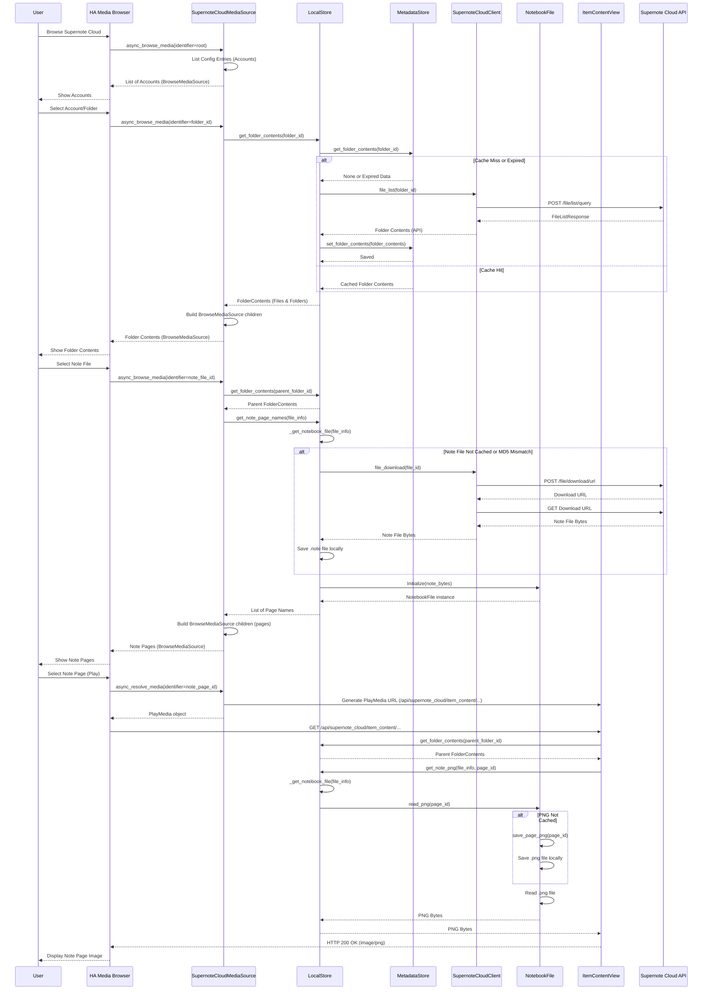

# Supernote Cloud Home Assistant Integration Architecture

This document outlines the architecture of the `supernote_cloud` custom component for Home Assistant.

## Core Goal

The primary purpose of this integration is to connect Home Assistant to the Supernote Cloud service. It focuses on making Supernote notes and their individual pages accessible through the Home Assistant Media Source browser interface.

## High-Level Component Diagram

## Authentication (`auth.py`, `config_flow.py`)

- **Setup:** Uses Home Assistant's standard Config Flow (`config_flow.py`) to securely collect the user's Supernote Cloud username and password during initial setup.
- **Token Acquisition:** A `LoginClient` (defined in `supernote_client/auth.py`) interacts with the Supernote API's multi-step login process (involving a random code and password hashing) to obtain an initial access token.
- **Token Management:** The `ConfigEntryAuth` class (`auth.py`) manages the access token:
  - Stores the token, username, and password securely within the Home Assistant `ConfigEntry`.
  - Checks token expiry based on a timestamp (`CONF_TOKEN_TIMESTAMP`) stored in the entry and a defined lifetime (`TOKEN_LIFEIME` in `const.py`, currently 5 days).
  - Automatically refreshes the token using the stored credentials via the `LoginClient` when it expires.
  - Handles `UnauthorizedException` errors from the API client by triggering Home Assistant's re-authentication flow via a callback (`reauth_cb` passed during setup).

### Authentication Flow (Initial Setup & Refresh)

## API Client (`supernote_client/`)

This sub-package encapsulates all direct interaction with the Supernote Cloud API (`https://cloud.supernote.com/api`).

- **HTTP Layer (`Client` in `supernote_client/auth.py`):**
  - A wrapper around `aiohttp.ClientSession` for making asynchronous HTTP requests.
  - Automatically injects the required `x-access-token` header using the active `AbstractAuth` implementation (`ConfigEntryAuth` during normal operation).
  - Provides helper methods (`get_json`, `post_json`) for making requests, parsing JSON responses into dataclasses, and handling common HTTP/network errors.
  - Raises specific exceptions (`ApiException`, `UnauthorizedException`) based on HTTP status codes.
- **API Models (`api_model.py`):**
  - Defines Python dataclasses using `mashumaro` that map directly to the JSON structures of the Supernote API requests and responses.
  - Handles field name differences (e.g., Python's `snake_case` vs. API's `camelCase`) using `mashumaro` field aliases.
- **Login Logic (`LoginClient` in `supernote_client/auth.py`):**
  - Orchestrates the specific sequence of API calls required for user login (get random code, encode password, get access token).
- **Core API Interaction (`SupernoteCloudClient` in `supernote_client/auth.py`):**
  - Provides methods for the main API functions needed by the integration:
    - `query_user`: Fetches user account details.
    - `file_list`: Lists files and folders within a specific Supernote Cloud directory.
    - `file_download`: Obtains a temporary download URL for a file and then fetches the file's content.
- **Exceptions (`exceptions.py`):**
  - Defines custom exceptions (`SupernoteException`, `ApiException`, `UnauthorizedException`) for clear error handling.

The integration maintains a local cache to reduce API calls and improve performance. Storage is located within the Home Assistant configuration directory under `.storage/supernote_cloud/{config_entry_id}/`.

- **Metadata Cache (`MetadataStore` in `store/store.py`):**
  - Uses Home Assistant's `Store` helper to persist folder contents (file/folder listings obtained from `file_list` API calls) as JSON (`folder_contents.json`).
  - Cached data includes a timestamp (`cache_ts`) and expires after a defined period (`MAX_CACHE_LIFETIME` in `store/model.py`, currently 1 hour).
- **File Cache (`LocalStore` in `store/store.py`):**
  - Manages the download and local storage of actual `.note` files.
  - Checks the `MetadataStore` first. If metadata is missing or expired, fetches it from the API via `SupernoteCloudClient`.
  - Downloads `.note` files from the cloud if they are not present locally or if the local file's MD5 hash (checked against the metadata) indicates it's outdated. Files are stored like: `{parent_folder_id}/{file_name}.note`.
- **Note Parsing & PNG Cache (`NotebookFile` in `store/store.py`):**
  - Uses the external `supernotelib` library to parse the contents of downloaded `.note` files.
  - Provides methods to get page names (`page_names`).
  - Converts individual note pages to PNG images *on demand* when requested.
  - Caches these generated PNGs locally in a subdirectory named after the note file stem: `{parent_folder_id}/{note_name_stem}/{page_name}.png`.

## Home Assistant Integration (`__init__.py`, `media_source.py`)

- **Setup (`async_setup`, `async_setup_entry` in `__init__.py`):**
  - Initializes the `SupernoteCloudClient` with `ConfigEntryAuth`.
  - Sets up the `LocalStore` (using `MetadataStore`) and stores it in the `ConfigEntry.runtime_data` (typed via `SupernoteCloudConfigEntry` in `types.py`).
  - Creates the necessary storage directories.
  - Registers the HTTP view for serving media content.
- **Media Source (`media_source.py`):**
  - Implements the `MediaSource` interface (`SupernoteCloudMediaSource`) to allow browsing Supernote content within the Home Assistant Media Browser.
  - Uses a custom `SupernoteIdentifier` (`config_entry_id:type:path`) to uniquely identify accounts, folders, note files, and note pages within the media browser hierarchy.
  - Browsing folders retrieves data primarily from the `LocalStore` (leveraging the metadata cache).
  - Browsing a `.note` file uses `LocalStore` and `NotebookFile` to list its pages.
  - Selecting a specific page resolves to a playable media item (`PlayMedia`) with a URL pointing to the custom HTTP view.
- **HTTP View (`ItemContentView` in `media_source.py`):**
  - A dedicated `aiohttp` view registered at `/api/supernote_cloud/item_content/{item_identifier}`.
  - Handles requests for individual note pages.
  - Decodes the `SupernoteIdentifier` from the URL.
  - Uses the `LocalStore` (accessed via the `ConfigEntry`) to:
    - Retrieve the necessary `FileInfo`.
    - Get the `NotebookFile` instance (downloading/parsing the `.note` file if needed).
    - Generate or retrieve the cached PNG for the requested page number.
  - Serves the PNG content with the correct `image/png` MIME type.

### Media Browsing & Playback Flow

